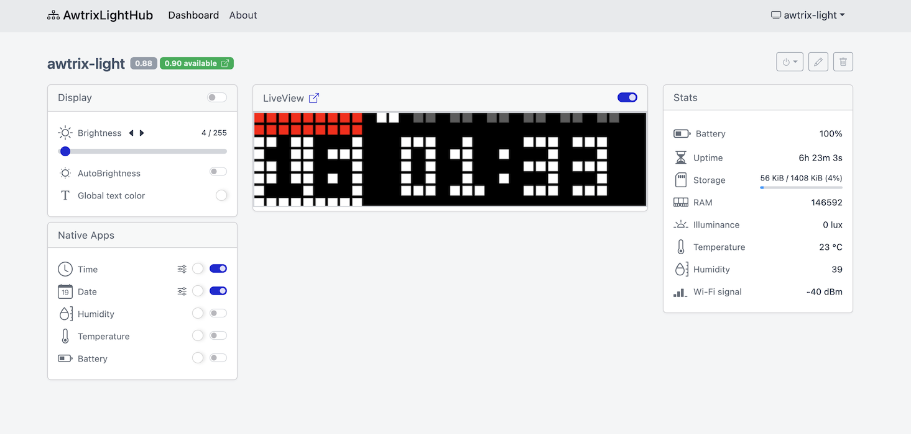

# awtrix-light-hub

> Coordination hub for awtrix-light devices, batteries included



## Usage

### Docker

```console
docker run -p 8080:8081 --name awtrix-hub -v $(pwd)./:/app/data --rm ghcr.io/awtrix-light/hub
```

### Docker Compose

See [docs/docker-compose-sqlite/](docs/docker-compose-sqlilte/) for an example


## License

`awtrix-light-hub` is licensed under MIT license. (see [LICENSE](./LICENSE))
